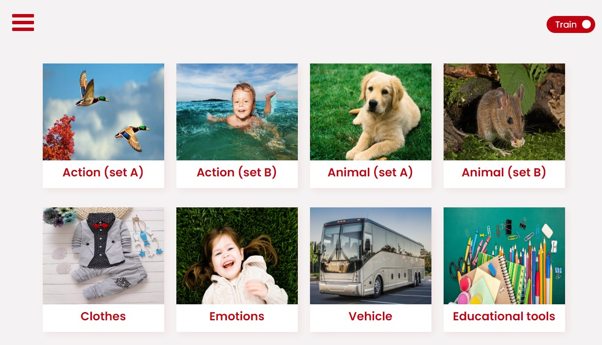

# English for kids

What it is:

This is a web application that allows you to learn english words. Just select the category you are interested in and dive in. In the learning mode, you can listen to the pronunciation of each word, as well as learn the translation by turning over the card. In game mode, listen to the pronunciation of the word and guess which picture it refers to. If you selected wrong one which card to appear difficult words section and you can train with difficult words. All statistics are stored in the table, you can always see the results of training and games.

Installation:
To build, download the files from the repository and install the dependencies use npm: npm install. After that, type 'npm run start' in console to run application in development mode, or 'npm run build' to get built bundle (appears in dist folder).

Deployed version you can find [here](https://english-for-kids-ashen.vercel.app/).

Technologies: Javascript, CSS, webpack, eslint.

Technical features:
Adaptive layout, application works equally well on desktops, tablets and mobile devices, fully responsive.
The provided layout is designed cross-browser. Browser requirements met: Chrome, Safari, Firefox latest versions.
The component approach is applied, the code is divided into modules.